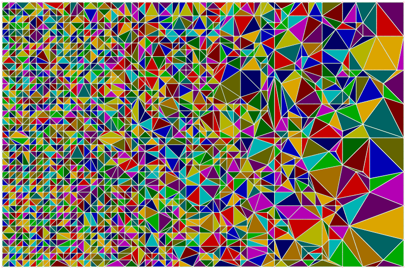

SimpleMeshDecimation
====================

Purpose: A tech demo type project to invalidate a number of points in a 2D grid, and then recreate a contiguous set of triangles over the remaining points. The original idea being that we can calculate simpler meshes for map tiles in a 3D application by some means, and then recreate the the set of triangles that we need to draw it.

This is not a comprehensive implementation that you would see in any "Delunay" method, but a simple implementation from first principles.

How It Works:
=============
1. Take a 2D grid, and set any number of points invalid.
2. Setup a window on the grid to process at one time, and ensure the corner points are valid. This is part of making sure the output set of lines and triangles cover the whole area.
3. Create a set of lines connecting each point. This is a superset of all lines that could form our new mesh.
4. Sort the lines in ascending length order.
5. Consider each line in turn, placing it in a result list, then any additional line has to not intersect any existing line in the result list. The outcome is that we have a set of lines to turn into triangles.
6. Going through the line list (and ranking point index values in ascending order) we look for an A -> B line, a B -> C line, and then a completing C -> A line. Recording this as a new trinagle.
7. Finally, we filter out the special case where we could have a traingle overlapping smaller nested triangles.

The output is our new triangulated surface. Its not fast enough to be used in real-time, but is certainly useful enough to pre-process map tiles to allow the new meshes to be saved off and loaded.

